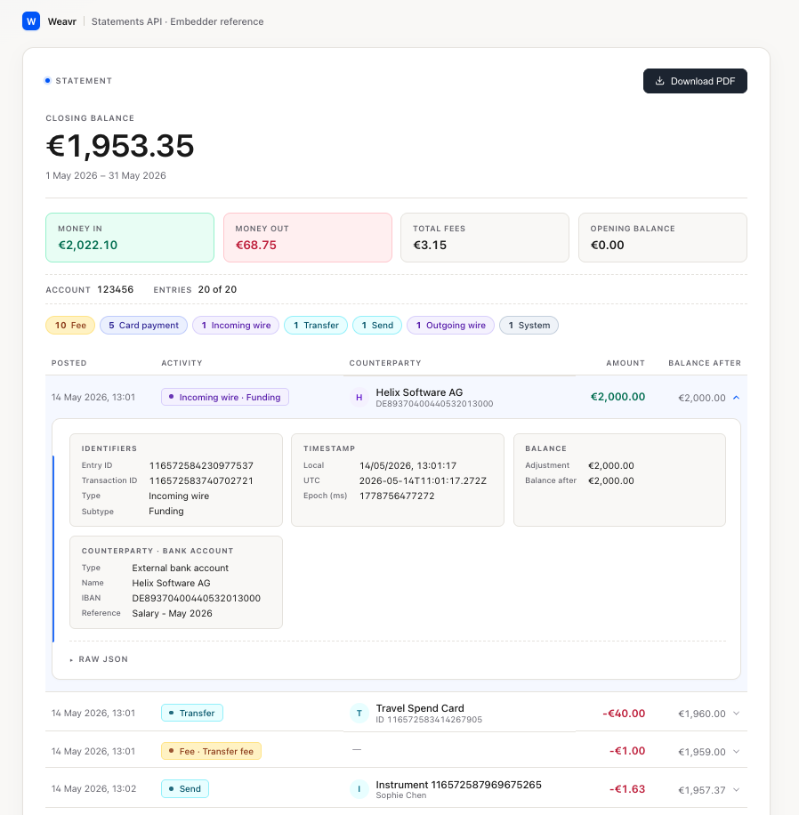

# Weavr Statements API — Embedder Reference



A minimal React + TypeScript reference for calling the new managed account statement endpoint, rendering the JSON response, and downloading the PDF.

## Run it

```bash
npm install
npm run dev
```

The dev server serves a captured fixture so the app works out of the box. Open the printed URL.

## What to copy

| File | What it gives you |
|---|---|
| [`src/api/statements.ts`](./src/api/statements.ts) | The two `fetch` functions (JSON + PDF). The canonical reference. |
| [`src/api/types.ts`](./src/api/types.ts) | TypeScript types for the statement response. |
| [`src/api/activity.ts`](./src/api/activity.ts) | The `fetch` functions for the account + card transaction feeds. |
| [`src/api/activity-types.ts`](./src/api/activity-types.ts) | TypeScript types for the transactions response (envelope + per-type payloads). |
| [`src/activity-display.ts`](./src/activity-display.ts) | How to derive a counterparty/status from the raw, per-type activity payload. |
| [`src/components/DownloadPdfButton.tsx`](./src/components/DownloadPdfButton.tsx) | The Blob → object URL → anchor → revoke download pattern. |
| [`src/format.ts`](./src/format.ts) | `formatMoney` (handles minor-unit currencies) and `formatTimestamp`. |

Everything else is presentation glue you can replace freely.

## Regenerating the fixture

The bundled `public/fixtures/statement.json` and `statement.pdf` were captured from a local OPC. To refresh:

```bash
# JSON
curl -sS \
  -H 'Accept: application/json' \
  -H 'Authorization: Bearer <YOUR_TOKEN>' \
  -H 'api-version: 2' \
  '<BASE_URL>/managed_accounts/<ACCOUNT_ID>/statement?startPeriod=<MS>&endPeriod=<MS>&limit=50&sortOrder=DESC' \
  > public/fixtures/statement.json

# PDF
curl -sS \
  -H 'Accept: application/pdf' \
  -H 'Authorization: Bearer <YOUR_TOKEN>' \
  -H 'api-version: 2' \
  '<BASE_URL>/managed_accounts/<ACCOUNT_ID>/statement?startPeriod=<MS>&endPeriod=<MS>&limit=50&sortOrder=DESC' \
  -o public/fixtures/statement.pdf
```

## Endpoint reference

The endpoint covered here is `GET /managed_accounts/{id}/statement`. Content negotiation is via the `Accept` header:

- `Accept: application/json` → `InstrumentStatement` (see `src/api/types.ts`)
- `Accept: application/pdf` → PDF binary

The full schema lives in `support/common-models/src/main/resources/commons.yml` (`StatementV2`) in the OPC repo. A symmetric endpoint exists for managed cards at `GET /managed_cards/{id}/statement` — same shape, same query params; extending this reference to cover it is a straight copy.

## Transactions / activity endpoint

Alongside the curated statement, the demo covers the raw transaction-activity feed
for both managed accounts and managed cards:

- `GET /managed_accounts/{id}/transactions`
- `GET /managed_cards/{id}/transactions`

Both return the same envelope shape — `{ responseCount, transactions[], count }` —
where each transaction carries a common envelope (`id`, `type`, `direction`,
`status`, `amount`, timestamps) plus a type-specific `transaction` payload. Unlike
the statement, there is **no running balance and no pre-normalized counterparty**:
the consumer derives those from the raw payload per `type` (see
`src/activity-display.ts`). JSON only — there is no PDF representation.

The **Activity** tab in the UI switches between the account and card feeds.

### Regenerating the activity fixtures

```bash
# Account activity
curl -sS \
  -H 'Accept: application/json' \
  -H 'Authorization: Bearer <YOUR_TOKEN>' \
  -H 'api-version: 2' \
  '<BASE_URL>/managed_accounts/<ACCOUNT_ID>/transactions?limit=50&sortOrder=DESC' \
  > public/fixtures/activity_account.json

# Card activity
curl -sS \
  -H 'Accept: application/json' \
  -H 'Authorization: Bearer <YOUR_TOKEN>' \
  -H 'api-version: 2' \
  '<BASE_URL>/managed_cards/<CARD_ID>/transactions?limit=50&sortOrder=DESC' \
  > public/fixtures/activity_card.json
```
